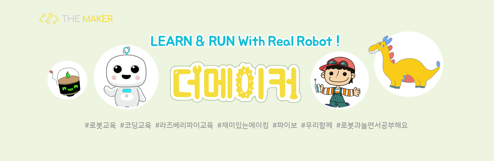

themakerrobot
=============
```
themaker는 인공지능 로봇 파이보 개발 회사인 서큘러스에서 만든 교육 브랜드입니다.
서큘러스는 로봇 스타트업으로, themaker는 다양한 IT 기술을 체계적으로 습득할 수 있는 교육 기회를 제공합니다.

themaker는 학생들이 하드웨어와 소프트웨어, 서비스 개발 등 다양한 IT 기술을 적극적으로 체험하고,
자신만의 로봇 서비스를 만들 수 있도록 하는 것이 핵심 가치입니다.
로봇과 콘텐츠를 활용하여 이론 수업뿐만 아니라 체험 교육을 제공하여, IT 기술을 재미있게 배울 수 있습니다.

또한, themaker에서는 교육용 로봇 파이보를 제어할 수 있는 파이썬 소프트웨어 패키지 Openpibo도 함께 제공합니다.
Openpibo는 로봇에 대한 이해도를 높일 수 있는 예제 코드와 함께 제공되며,
학생들이 로봇을 직접 제어하며 새로운 기술과 경험을 습득할 수 있도록 돕습니다.
```
+ Openpibo 소프트웨어
  - Repository
    + openpibo-python(Python package) [바로가기](https://github.com/themakerrobot/openpibo-python)
    + openpibo-os(SW for openpibo) [바로가기](https://github.com/themakerrobot/openpibo-os)
    + openpibo-examples(python example using openpibo-python) [바로가기](https://github.com/themakerrobot/openpibo-examples)
    + openpibo-files(image/audio file for openpibo) [바로가기](https://github.com/themakerrobot/openpibo-files)
  - Openpibo 운영체제 (Only user for openpibo)
    + H/W: Raspberry Pi 4B / Raspberry Pi 3B+ (3B 표기)
    + [OS 다운로드 바로가기](https://circulusworkspace-my.sharepoint.com/:f:/g/personal/leeyunjai_circul_us1/EksdEBIKQ6JJplSWtsad-CUBHbI3354b_5FCIWHsmNL_8g?e=i9ZeEd)
    + [릴리즈노트 바로가기](https://github.com/themakerrobot/themakerrobot/releases)
  - Openpibo 가이드
    + [Docs 바로가기](https://themakerrobot.github.io/openpibo-python/build/html/index.html)
> 교육 문의: ```yeonah@circul.us```
