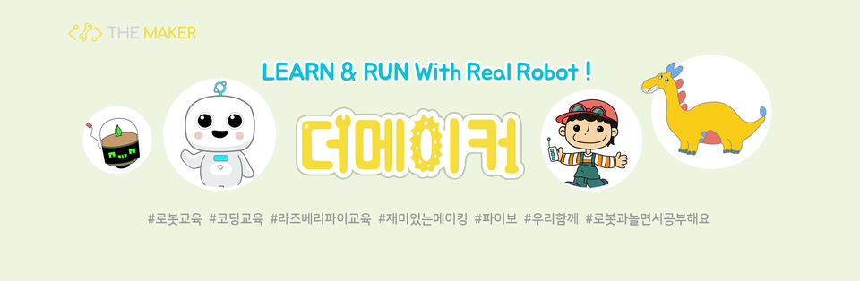

themakerrobot
=============
```
더메이커는 인공지능 로봇 파이보를 개발한 서큘러스에서 설립한 교육 브랜드로,

로봇 개발에 직접 참여한 실무 경험을 바탕으로 보다 차별화된 인공지능, 소프트웨어 교육을 진행합니다.

더메이커에서 직접 개발한 로봇 키트와 콘텐츠를 통해 하드웨어, 소프트웨어, 서비스 개발 등 

전반적인 IT기술을 이해하고, 나만의 로봇을 만들 수 있습니다. 

Openpibo는 교육용 로봇 파이보를 쉽게 사용할 수 있도록 제작한 소프트웨어 모음입니다.
```
+ Openpibo 소프트웨어
  - Repository
    + openpibo-python(Python library)
    + openpibo-tools(Tools for openpibo)
    + openpibo-examples(python example using openpibo-python)
    + openpibo-files(Test and system file)
  - Openpibo 운영체제 (Only user for openpibo)
    + H/W: Raspberry Pi 4B / Raspberry Pi 3B+ (3B 표기)
    + 최신버전: EOS_PIBO_220701_V1, EOS_PIBO_3B_220701_V1
    + [다운로드 링크](https://circulusworkspace-my.sharepoint.com/:f:/g/personal/leeyunjai_circul_us1/EksdEBIKQ6JJplSWtsad-CUB4Me7vOm2qBGoW1tGiA89ag?e=PJ0pxV)
    
  - [릴리즈노트](https://github.com/themakerrobot/themakerrobot/blob/main/ReleaseNotes/2022.md)
  - [Openpibo 가이드](https://themakerrobot.github.io/openpibo-python/build/html/index.html)
> 교육 문의: ```yeonah@circul.us```
