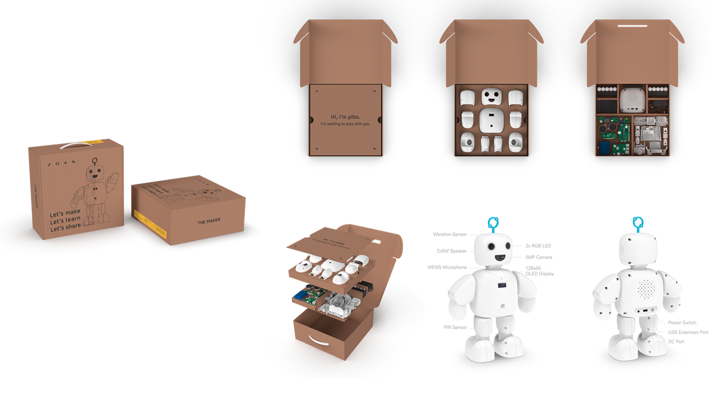

> 안녕하세요. THE MAKER입니다. 이곳은 교육용 파이보에 대한 Repository입니다. 
>
> 곧, THE MAKER 교육 플랫폼이 오픈될 예정입니다. [[themaker]](https://themaker.circul.us) 
> 교육에 대한 문의는 "yeonah@circul.us"로 보내주시면 감사하겠습니다.

+ openpibo 라이브러리에 대한 가이드: [link](https://themakerrobot.github.io/openpibo-python/build/html/index.html)
+ 교육용 파이보 운영체제(교육용 파이보를 위한 운영체제이며, 다른 용도로는 사용이 어려울 수 있습니다.)
  - 운영체제 배포
    + 2021/12/06 OS([link](https://drive.google.com/file/d/1c7yACdRlR7aM87xkV0wY1ElHurEeKfhW/view?usp=sharing)) - 211206v2
    <pre>
    중요 업데이트! > 로그인 passwd가 기존 raspberry 에서 pibo0314로 변경되었습니다. 참고바랍니다.
    </pre>
    + 2021/12/15 OS([link](https://drive.google.com/file/d/1S0MXuIjSwGq3Yd-CS7sqVXkbOKWCgxDl/view?usp=sharing)) - 211215v1
    <pre>
    TEST 버전
    </pre>   
    
  - 릴리즈노트
    + [link](https://github.com/themakerrobot/themakerrobot/blob/main/ReleaseNotes.md)

<pre>
* 공지사항
<code>
 - 호환기기 : Raspberrypi(3B+, 4B)
   + 3B+: SW 업데이트가 필요합니다. (cd ~;sudo ./update.sh)
 - 운영체제: Stable OS(Raspbian)
</code>
</pre>
