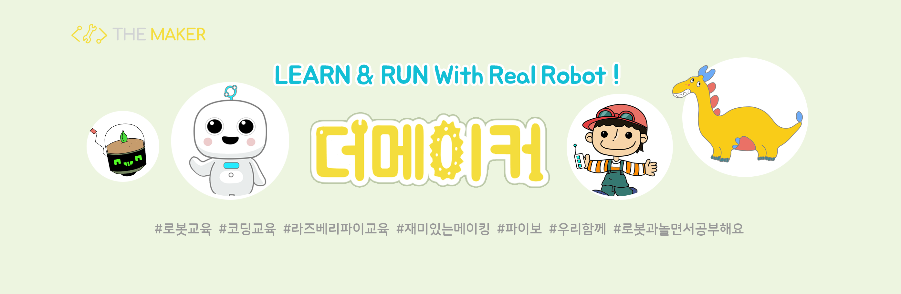
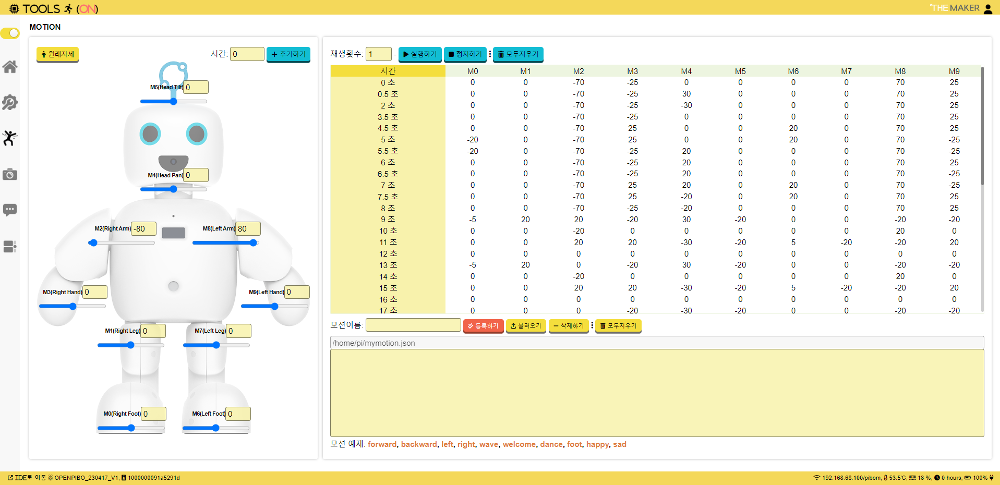
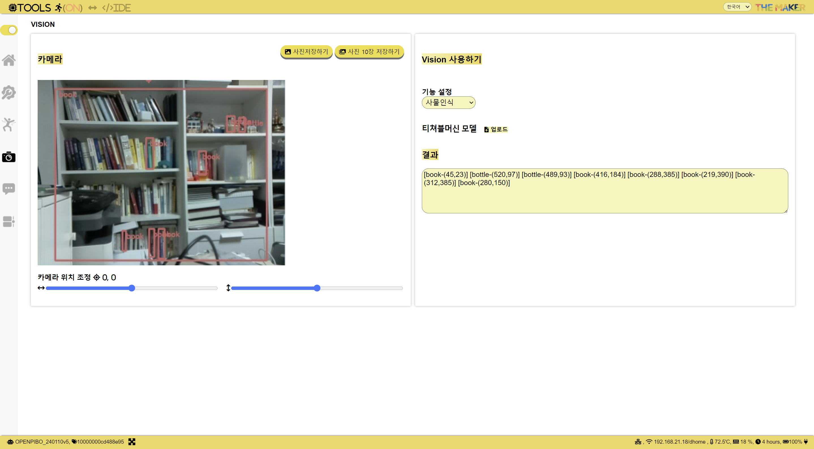
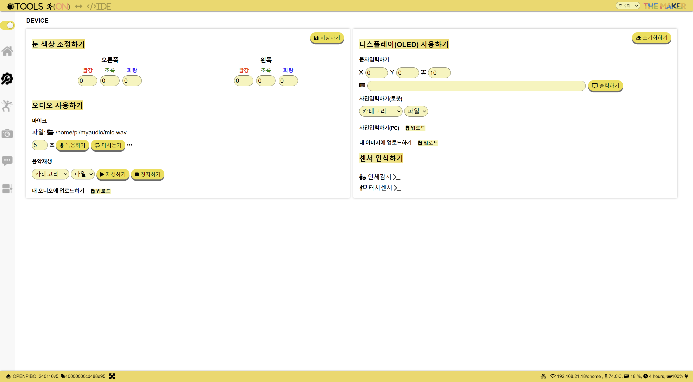
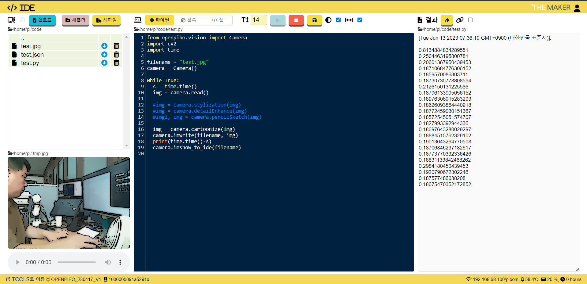
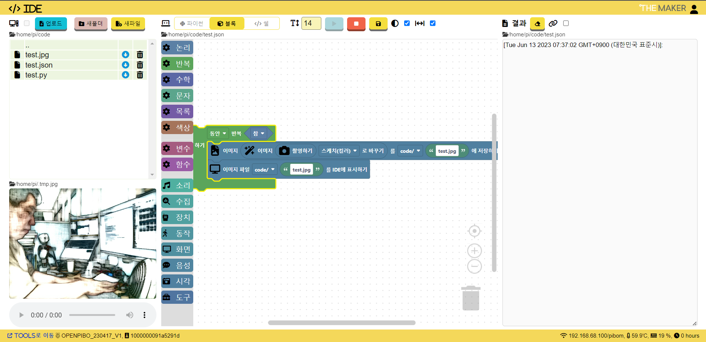
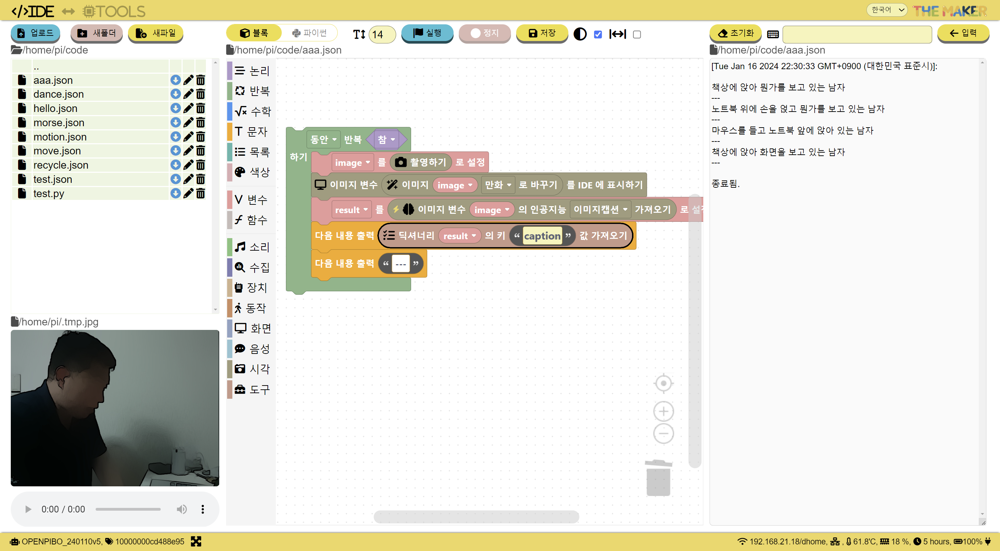
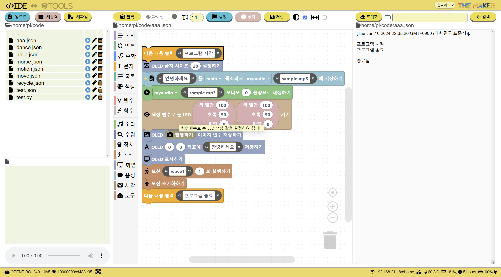

THE MAKER
=============
```
THE MAKER는 인공지능 로봇 파이보를 개발한
로봇 스타트업 서큘러스의 교육 브랜드입니다.
학생들이 하드웨어, 소프트웨어, 서비스 개발 등
다양한 IT 기술을 직접 체험하며 자신만의 로봇 서비스를
만들 수 있도록 돕는 것이 핵심 가치입니다.
로봇과 콘텐츠를 활용한 체험 교육으로
IT 기술을 재미있게 배울 수 있으며,
themakerrobot repository를 통해 교육용 로봇 파이보를
제어하는 파이썬 패키지 Openpibo와 예제 코드도
함께 제공합니다.
```
+ Openpibo 소프트웨어
  - Openpibo 운영체제 (Only for piBo or piBrain)
    + H/W: Raspberry Pi 4B / Raspberry Pi 3B+ (3B 표기)
    + [공유자료-운영체제/사용가이드 바로가기](https://circulusworkspace-my.sharepoint.com/:f:/g/personal/leeyunjai_circul_us1/IgBLHRASCkOiSaZUlrbGnfglAbEknmT2sq_XVxMRmbLLUrM?e=o2QL8Z)
  - Openpibo 가이드
    + [Old](https://themakerrobot.github.io/openpibo-python/build/html/index.html)
    + [파이브레인26](https://themakerrobot.github.io/openpibo-os.pibrain/build/html/index.html)
    + [파이보26](https://themakerrobot.github.io/openpibo-os.pibo/build/html/index.html)
> 교육 문의: ```yeonah@circul.us```
> [>>> Link To Shop](https://smartstore.naver.com/circulus/products/5493295821)
Pibo Maker
=============
```
Pibo Maker는 로봇의 개별 기능을 체험·제어하는
Tools와 Python·Block 코딩 개발환경인 IDE를 제공합니다.

[Tools]
모터, 센서, 카메라, 마이크 등 로봇을 구성하는
하드웨어와 소프트웨어를 제어하는 도구를 제공합니다.
각 기능을 독립적으로 테스트하고 제어할 수 있습니다.
움직임을 시뮬레이션하거나 실제 모터를 동작시키고,
주변 환경을 감지하는 능력을 시험해 데이터를 확인합니다.
이를 통해 로봇의 작동 원리를 이해할 수 있습니다.

[IDE]
Python과 Block 코딩을 지원하며,
이미지/오디오 player, 탐색기, 로그 뷰어 등을 제공합니다.
Python으로는 다양한 라이브러리를 활용해
로봇의 인공지능 기능을 개발할 수 있습니다.
Block 코딩은 시각적 블록을 조합하는 방식이라,
프로그래밍 경험이 없어도 쉽게 기능을 구현할 수 있습니다.
```
+ Tools
  - 
  - 
  - 
+ IDE
  - 
  - 
  - 
  - 
#교육용로봇 #파이보 #Pibo #AI #인공지능 #머신러닝 #딥러닝 #Block #블록 #개발도구 #프로그래밍 #소프트웨어 #하드웨어 #서비스 #IT기술 #에듀테크 #edutech #블록코딩 #파이썬 #python #Blockly #메이커 #Maker
