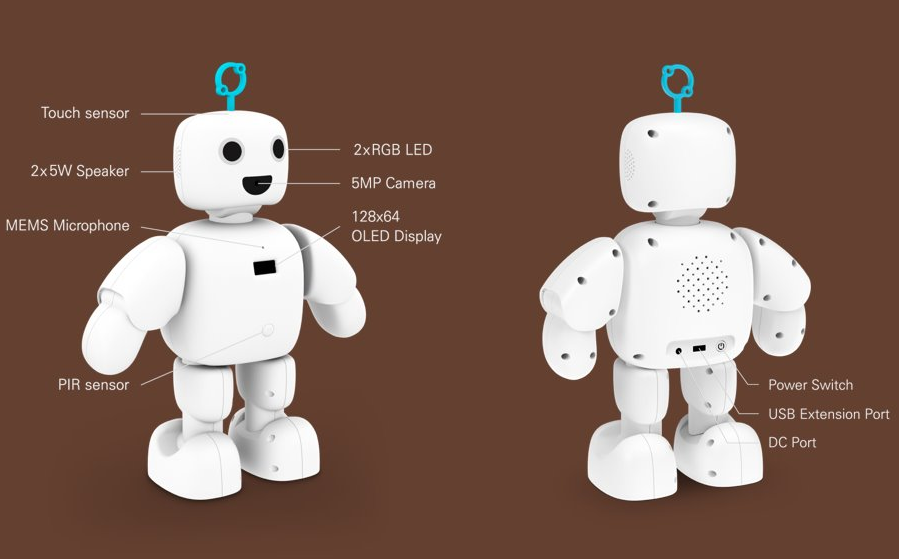
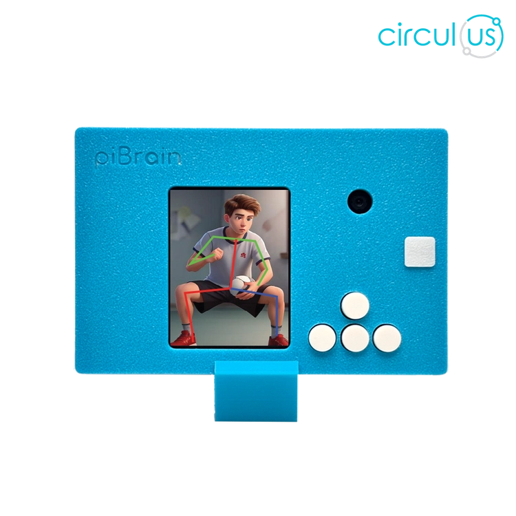

# THE MAKER

인공지능 로봇 **파이보(Pibo)** 와 **파이브레인(piBrain)** 으로 블록 코딩부터 파이썬 AI까지 배우는, 로봇 스타트업 **서큘러스**의 교육 브랜드입니다.

  <a href="https://smartstore.naver.com/circulus/products/5493295821"><b>🛒 구매하기</b></a> &nbsp;·&nbsp;
  <a href="mailto:info@circul.us"><b>✉️ 교육 문의 (info@circul.us)</b></a> &nbsp;·&nbsp;
  <a href="https://themakerrobot.github.io/openpibo-guide/"><b>📘 문서·예제</b></a> &nbsp;·&nbsp;
  <a href="https://pibo-lab.themaker.workers.dev/"><b>🧪 파이보랩</b></a> &nbsp;·&nbsp;
  <a href="http://pibo.circul.us"><b>🏠 홈페이지</b></a>

---

## 🤖 기기

<table>
<tr>
<td width="50%" align="center"> <b>파이보 (Pibo)</b> 움직이는 휴머노이드 로봇 모터 · 카메라 · 마이크 · 스피커 · 센서</td>
<td width="50%" align="center"> <b>파이브레인 (piBrain)</b> 화면과 버튼이 달린 AI 보드 카메라 · LCD · 버튼</td>
</tr>
</table>

---

## 🚀 시작하기

1. 기기의 **OS 버전**을 확인합니다.
2. [문서·예제 사이트](https://themakerrobot.github.io/openpibo-guide/)에서 **같은 버전**의 문서와 예제를 엽니다.
3. 기기의 **IDE**(Pibo Maker)에서 블록 또는 파이썬으로 실행합니다.

| 기기 | 최신 배포 | 문서 | 예제 |
|---|---|---|---|
| Pibo | `260624v1` | [문서](https://themakerrobot.github.io/openpibo-guide/pibo/260624v1/index.html) | [예제](https://github.com/themakerrobot/openpibo-guide/tree/main/pibo/260624v1) |
| piBrain | `260624v1` | [문서](https://themakerrobot.github.io/openpibo-guide/pibrain/260624v1/index.html) | [예제](https://github.com/themakerrobot/openpibo-guide/tree/main/pibrain/260624v1) |
| Pibo 구버전 | `v0.9.2.73` | [문서](https://themakerrobot.github.io/openpibo-guide/pibo/v0.9.2.73/index.html) | — |

### 운영체제

- 지원 하드웨어: **Raspberry Pi 4B**
- 📂 [운영체제 이미지 · 사용 가이드 (공유 폴더)](https://circulusworkspace-my.sharepoint.com/:f:/g/personal/leeyunjai_circul_us1/IgBLHRASCkOiSaZUlrbGnfglAbEknmT2sq_XVxMRmbLLUrM?e=o2QL8Z)

---

## 🛠 Pibo Maker

기기 안에 들어 있는 개발 환경입니다. 브라우저로 접속해서 씁니다.

- **Tools** — 모터, 센서, 카메라, 마이크를 하나씩 켜 보고 값을 확인하며 로봇의 작동 원리를 익힙니다.
- **IDE** — 블록 코딩과 파이썬을 지원합니다. 이미지·오디오 재생, 파일 탐색기, 로그 보기가 함께 있습니다.

<table>
<tr>
<td></td>
<td></td>
<td></td>
</tr>
<tr>
<td></td>
<td></td>
<td></td>
</tr>
</table>

---

## 🧰 파이보 활용 소프트웨어

| 이름 | 하는 일 | 바로가기 |
|---|---|---|
| **파이보랩** | 기기 없이 온라인에서 파이보를 체험하고 활용합니다 | [열기](https://pibo-lab.themaker.workers.dev/) |
| **pibo-connect** | 교실의 파이보·파이브레인 여러 대를 브라우저 한 장으로 찾고, 같은 코드를 한 번에 실행합니다 | [저장소](https://github.com/themakerrobot/pibo-connector) |

## 🧠 AI 교육 소프트웨어

로봇 없이 브라우저나 PC만으로 AI를 배웁니다.

| 이름 | 하는 일 | 바로가기 |
|---|---|---|
| **Teach Lab** | 웹캠·마이크로 보여 준 것을 브라우저 안에서 바로 AI에게 가르칩니다 | [열기](https://themakerrobot.github.io/teach-lab/) · [저장소](https://github.com/themakerrobot/teach-lab) |
| **edge-lab** | 인터넷 없이 내 PC 안에서 도는 AI 학습 도구입니다 | [저장소](https://github.com/themakerrobot/edge-lab) |

---

## 🎓 이렇게 배웁니다

| 단계 | 내용 |
|:---:|---|
| **체험** | 로봇의 모터·센서·카메라를 직접 만지며 작동 원리를 익힙니다 |
| **코딩** | 블록 코딩으로 시작해 파이썬으로 자연스럽게 넘어갑니다 |
| **제작** | 배운 기술을 모아 나만의 로봇 서비스를 완성합니다 |

---

  구매·교육 문의 <a href="mailto:info@circul.us">info@circul.us</a> · <a href="https://smartstore.naver.com/circulus/products/5493295821">네이버 스토어</a>

