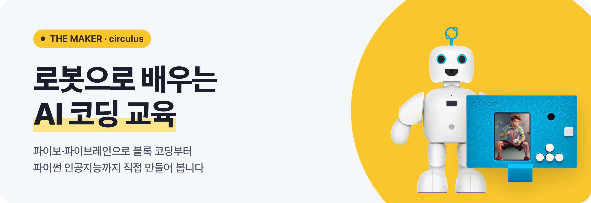
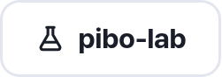
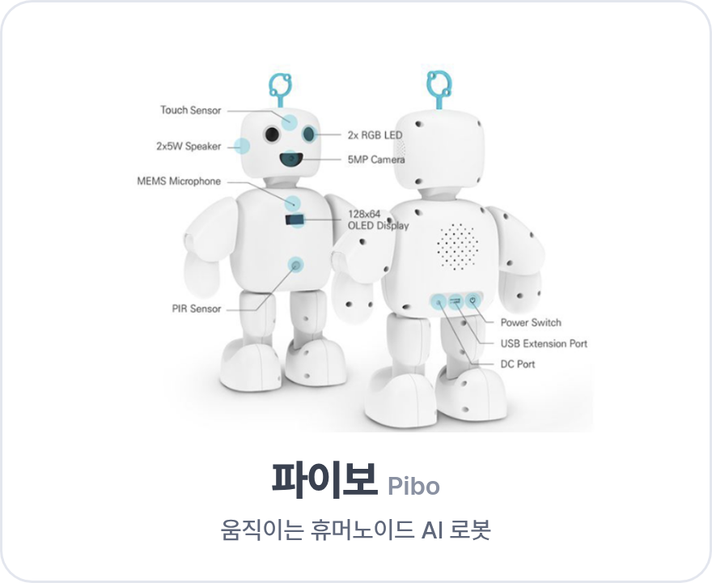
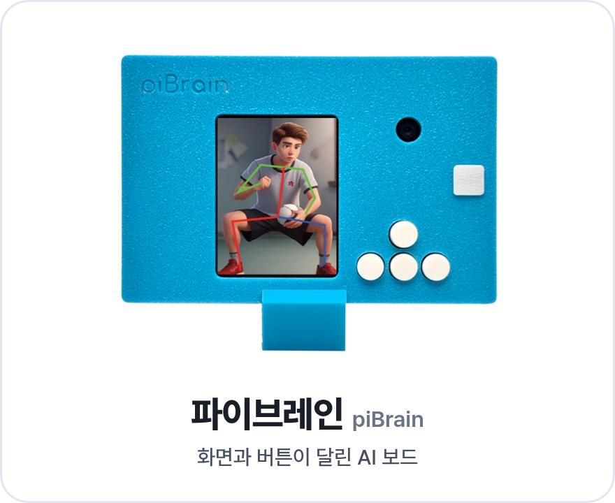
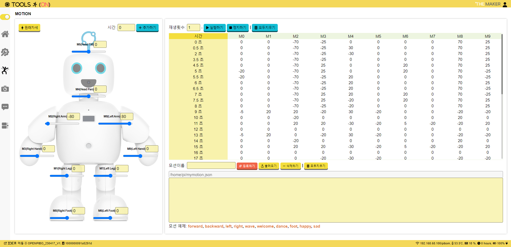
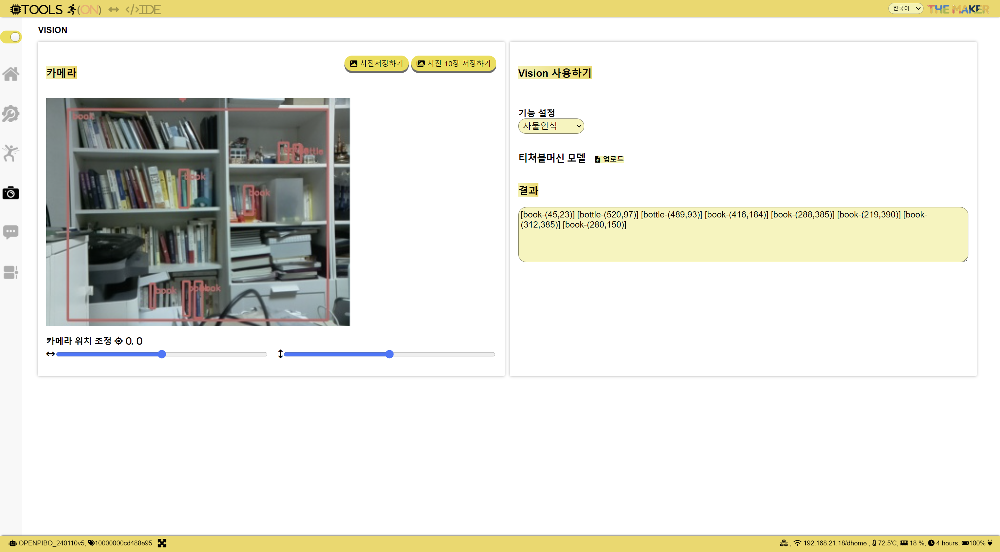
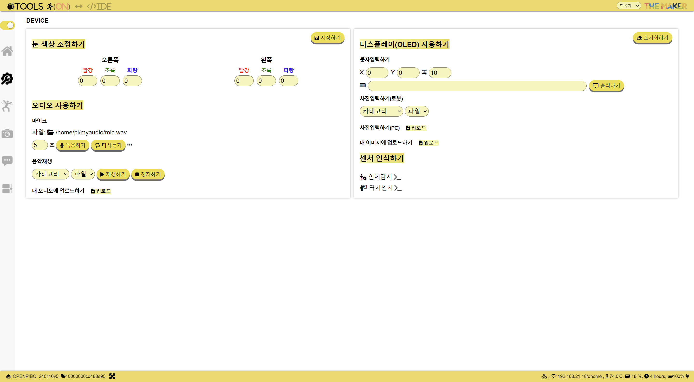
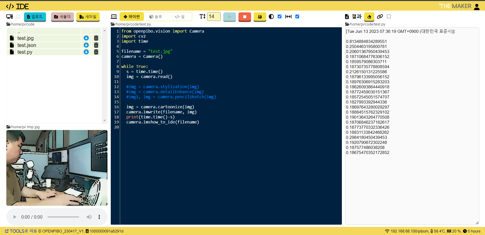
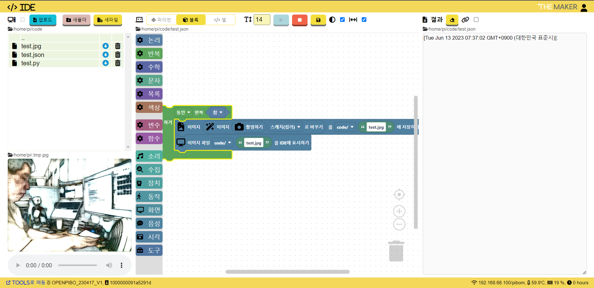
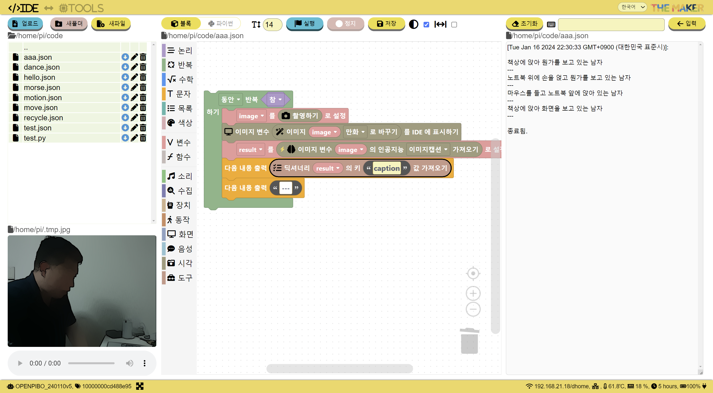

  
  
  
  
  

  서큘러스의 교육 브랜드 <b>THE MAKER</b>입니다. 인공지능 로봇 파이보와 파이브레인으로 
  블록 코딩부터 파이썬 AI까지, 직접 만지고 코딩하며 나만의 로봇 서비스를 만듭니다.

 

  
  

## 시작하기

1. 기기의 **OS 버전**을 확인합니다.
2. [문서·예제 사이트](https://themakerrobot.github.io/openpibo-guide/)에서 **같은 버전**의 문서와 예제를 엽니다.
3. 기기 안의 **Pibo Maker**(IDE)에서 블록이나 파이썬으로 실행합니다.

| 기기 | 최신 배포 | 문서 | 예제 |
|---|---|---|---|
| 파이보 | `260624v1` | [열기](https://themakerrobot.github.io/openpibo-guide/pibo/260624v1/index.html) | [열기](https://github.com/themakerrobot/openpibo-guide/tree/main/pibo/260624v1) |
| 파이브레인 | `260624v1` | [열기](https://themakerrobot.github.io/openpibo-guide/pibrain/260624v1/index.html) | [열기](https://github.com/themakerrobot/openpibo-guide/tree/main/pibrain/260624v1) |
| 파이보 구버전 | `v0.9.2.73` | [열기](https://themakerrobot.github.io/openpibo-guide/pibo/v0.9.2.73/index.html) | — |

**운영체제** · 지원 하드웨어 Raspberry Pi 4B · [운영체제 이미지와 사용 가이드 (공유 폴더)](https://circulusworkspace-my.sharepoint.com/:f:/g/personal/leeyunjai_circul_us1/IgBLHRASCkOiSaZUlrbGnfglAbEknmT2sq_XVxMRmbLLUrM?e=o2QL8Z)

## Pibo Maker

기기 안에 들어 있는 개발 환경입니다. 같은 와이파이에 연결한 PC 브라우저로 접속해서 씁니다.

- **Tools** — 모터, 센서, 카메라, 마이크를 하나씩 켜 보고 값을 확인하며 로봇의 작동 원리를 익힙니다.
- **IDE** — 블록 코딩과 파이썬을 지원합니다. 이미지·오디오 재생, 파일 탐색기, 로그 보기가 함께 있습니다.

    
    

## 파이보 · 파이브레인 활용 소프트웨어

| 이름 | 하는 일 | 바로가기 |
|---|---|---|
| **파이보랩** | 기기 없이 온라인에서 파이보를 체험하고 활용합니다 | [열기](https://pibo-lab.themaker.workers.dev/) |
| **Code Lab** | 블록과 파이썬으로 코딩하고, 브라우저나 USB로 연결한 파이브레인에서 바로 실행합니다 | [열기](https://themakerrobot.github.io/code-lab/) · [저장소](https://github.com/themakerrobot/code-lab) |
| **pibo-connect** | 교실의 파이보·파이브레인 여러 대를 한 화면에서 찾고, 같은 코드를 한 번에 실행합니다 | [저장소](https://github.com/themakerrobot/pibo-connector) |

## AI 교육 소프트웨어

로봇 없이 브라우저나 PC만으로 AI를 배웁니다.

| 이름 | 하는 일 | 바로가기 |
|---|---|---|
| **Teach Lab** | 웹캠·마이크로 보여 준 것을 브라우저 안에서 바로 AI에게 가르칩니다 | [열기](https://themakerrobot.github.io/teach-lab/) · [저장소](https://github.com/themakerrobot/teach-lab) |
| **edge-lab** | 인터넷 없이 내 PC 안에서 도는 AI 학습 도구입니다 | [저장소](https://github.com/themakerrobot/edge-lab) |

## 이렇게 배웁니다

| 체험 | 코딩 | 제작 |
|---|---|---|
| 로봇의 모터·센서·카메라를 직접 만지며 작동 원리를 익힙니다 | 블록 코딩으로 시작해 파이썬으로 자연스럽게 넘어갑니다 | 배운 기술을 모아 나만의 로봇 서비스를 완성합니다 |

---

  구매·교육 문의 <a href="mailto:info@circul.us">info@circul.us</a> · <a href="https://smartstore.naver.com/circulus/products/5493295821">네이버 스토어</a> · <a href="http://pibo.circul.us">pibo.circul.us</a>

