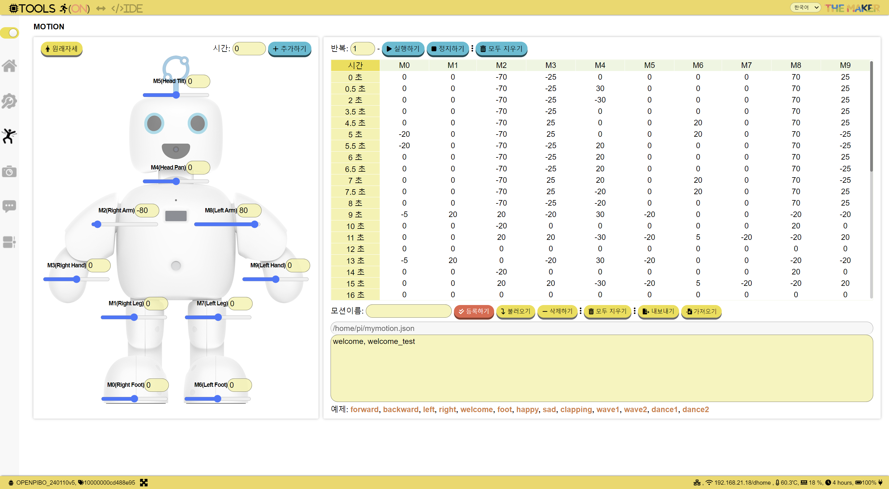
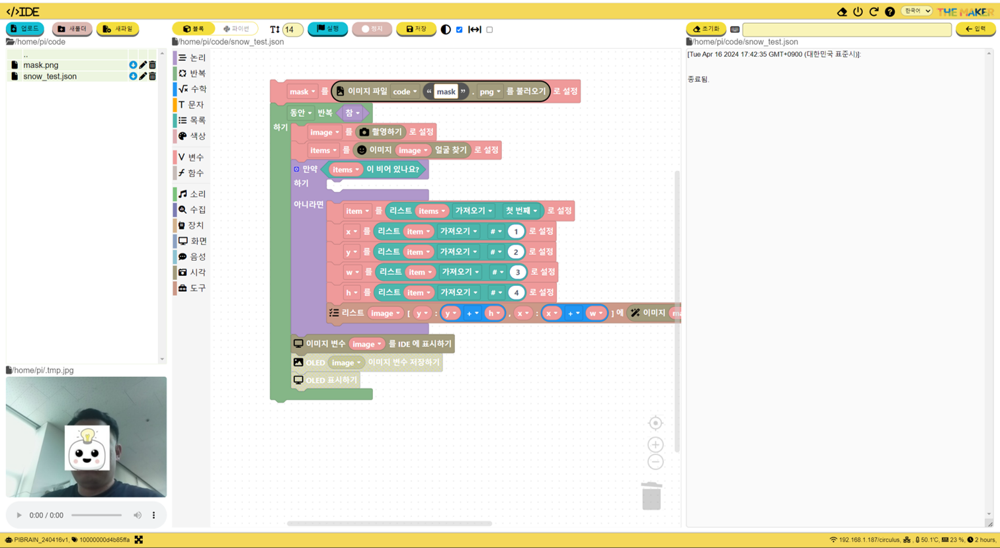

THE MAKER
=============
```
THE MAKER는 인공지능 로봇 파이보 개발 회사인 서큘러스에서 만든 교육 브랜드입니다.
서큘러스는 로봇 스타트업으로, THE MAKER는 다양한 IT 기술을 체계적으로 습득할 수 있는 교육 기회를 제공합니다.

THE MAKER는 학생들이 하드웨어와 소프트웨어, 서비스 개발 등 다양한 IT 기술을 적극적으로 체험하고,
자신만의 로봇 서비스를 만들 수 있도록 하는 것이 핵심 가치입니다.
로봇과 콘텐츠를 활용하여 이론 수업뿐만 아니라 체험 교육을 제공하여, IT 기술을 재미있게 배울 수 있습니다.

또한, THE MAKER는 themakerrobot repository를 통해 교육용 로봇 파이보를 제어할 수 있는 파이썬 소프트웨어 패키지 Openpibo도 함께 제공합니다.
Openpibo는 로봇에 대한 이해도를 높일 수 있는 예제 코드와 함께 제공되며, 학생들이 로봇을 직접 제어하며 새로운 기술과 경험을 습득할 수 있도록 돕습니다.
```
+ Openpibo 소프트웨어
  - Repository
    + themakerrobot [바로가기](https://github.com/themakerrobot/themakerrobot)
    + openpibo-python(Python package) [바로가기](https://github.com/themakerrobot/openpibo-python)
    + openpibo-os(SW for openpibo) [바로가기](https://github.com/themakerrobot/openpibo-os)
    + openpibo-examples(python example using openpibo-python) [바로가기](https://github.com/themakerrobot/openpibo-examples)
    + openpibo-files(image/audio file for openpibo) [바로가기](https://github.com/themakerrobot/openpibo-files)
  - Openpibo 운영체제 (Only for piBo or piBrain)
    + H/W: Raspberry Pi 4B / Raspberry Pi 3B+ (3B 표기)
    + [공유자료-운영체제/사용가이드 바로가기](https://circulusworkspace-my.sharepoint.com/:f:/g/personal/leeyunjai_circul_us1/EksdEBIKQ6JJplSWtsad-CUBoJym7kMEoRJiHey9u-4AVw?e=TVf4Tm)
    + [릴리즈노트 바로가기](https://github.com/themakerrobot/themakerrobot/releases)
  - Openpibo 가이드
    + [Docs 바로가기](https://themakerrobot.github.io/openpibo-python/build/html/index.html)
> 교육 문의: ```yeonah@circul.us```

> [>>> Link To Shop](https://smartstore.naver.com/circulus/products/5493295821)

Pibo Maker
=============
```
Pibo Maker는 로봇의 개별 기능을 체험하고 제어할 수 있는 **Tools**과 Python, Block코딩 개발환경인 **IDE**를 제공합니다.

Tools 섹션에서는 로봇을 구성하는 모터, 센서, 카메라, 마이크 등의 하드웨어와 소프트웨어를 제어할 수 있는 도구를 제공합니다. 
로봇의 기능을 독립적으로 테스트하고 제어함으로써 로봇의 작동 방식과 동작을 이해할 수 있습니다. 
예를 들어, 로봇의 움직임을 시뮬레이션하거나 실제 모터를 동작시켜 볼 수 있고, 로봇이 주변 환경을 감지하는 능력을 시험하고 데이터를 확인할 수 있습니다.
이러한 도구들을 통해 로봇의 개별 기능을 체험하고 제어함으로써 로봇의 작동 원리를 이해할 수 있습니다.

IDE는 개발 환경으로 Python과 Block 코딩을 지원하고, 이미지/오디오 player, 탐색기, 로그 뷰어 등을 제공합니다. 
Python은 강력한 프로그래밍 언어로 다양한 기능과 라이브러리를 활용하여 로봇의 인공지능 기능을 개발할 수 있습니다.
Block 코딩은 시각적인 블록을 조합하여 프로그램을 작성하는 방식으로, 프로그래밍 경험이 없는 사람들도 쉽게 로봇의 기능을 구현하고 활용할 수 있습니다.

```
+ Tools
  - 
  - 
  - 
+ IDE
  - 
  - 
  - 
  - 

#교육용로봇 #파이보 #Pibo #AI #인공지능 #머신러닝 #딥러닝 #Block #블록 #개발도구 #프로그래밍 #소프트웨어 #하드웨어 #서비스 #IT기술 #에듀테크 #edutech #블록코딩 #파이썬 #python #Blockly #메이커 #Maker
